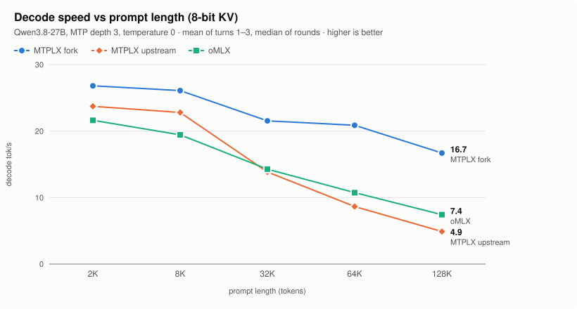
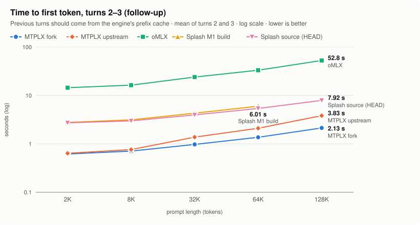
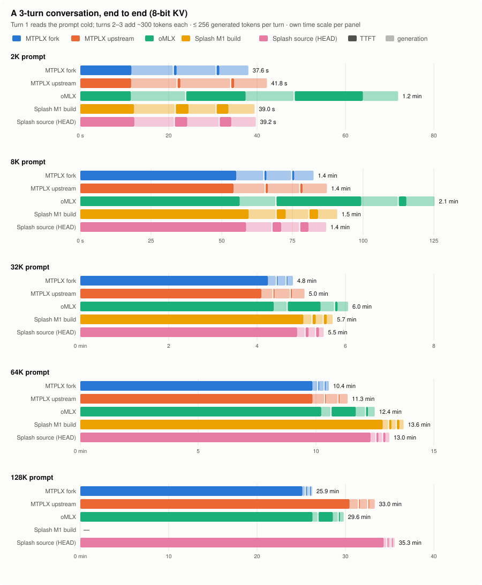
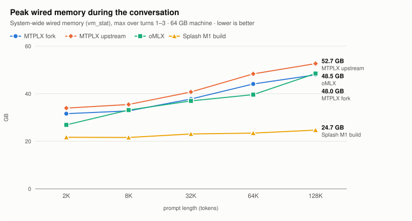

# Apple Silicon LLM engine benchmark: long-context, multi-turn

English | [日本語](README.ja.md)

How fast is a **3-turn conversation over a long prompt** on a Mac, depending on the
inference engine? Three engines serve the **same Qwen3.8-27B model files** with MTP
speculative decoding (depth 3) and 8-bit KV cache, on a MacBook Pro with M1 Max and
64 GB, measured the same way over each engine's OpenAI-compatible streaming API.

| engine | version | notes |
|---|---|---|
| **MTPLX fork** | [`shunya1810/MTPLX@16751dc`](https://github.com/shunya1810/MTPLX/tree/m1max-longctx) | M1-family long-context branch, maintained by the author of this benchmark |
| **MTPLX upstream** | [`youssofal/MTPLX@1de2b1c`](https://github.com/youssofal/MTPLX/commit/1de2b1c049136ed117af0c6712baaadd81820b51) | `main` at run time; the fork's base |
| **oMLX** | [0.6.4](https://github.com/jundot/omlx/releases/tag/v0.6.4) | latest stable at run time |

Results so far: 2K–64K (2 rounds each). 128K is prepared and will be added to this page.

## Highlights (64K prompt, 8-bit KV)

- **Decode:** MTPLX fork **20.9 tok/s**, oMLX 10.7, MTPLX upstream 8.7 (mean of the three
  turns). The fork's lead grows with the prompt: +13–35% at 2K–8K, about 1.5× at 32K,
  2.0–2.4× at 64K.
- **Follow-up turns:** time to first token for turns 2 and 3 is **1.4 s** on the fork,
  2.1 s on upstream, and 1.0 min / 4.8 s on oMLX. oMLX keeps its prefix cache on SSD in
  4,096-token blocks and, for this model family, can save a prompt only up to the last
  block boundary it crossed, so the next turn re-reads the rest (up to ~4K tokens).
- **The first turn costs the same everywhere:** reading a 64K prompt cold takes 9.7–10.2
  minutes on all three, and a 2K prompt 11.4–11.5 s. The prefill is bound by the same MLX
  quantized matrix multiply (about 7.9 TFLOPS at 2K on this GPU).
- **Whole conversation:** 10.3 min (fork), 11.3 min (upstream), 12.4 min (oMLX).
- **Memory:** peak wired memory 39.6 GB (oMLX), 42.7 GB (fork), 48.4 GB (upstream).
- **Output check:** every engine quoted the needle line correctly in turn 3 in every run.

## Decode speed

<picture>
  <source media="(prefers-color-scheme: dark)" srcset="charts/decode-dark.svg">
  
</picture>

## Follow-up turns

<picture>
  <source media="(prefers-color-scheme: dark)" srcset="charts/ttft-followup-dark.svg">
  
</picture>

## The whole conversation

<picture>
  <source media="(prefers-color-scheme: dark)" srcset="charts/conversation-dark.svg">
  
</picture>

## Memory

<picture>
  <source media="(prefers-color-scheme: dark)" srcset="charts/memory-dark.svg">
  
</picture>

## Tables

Median of 2 rounds per cell. `cached` is the engine-reported
`usage.prompt_tokens_details.cached_tokens`. Wired memory is system-wide.

| context | engine | T1 TTFT (cold) | T2 TTFT | T3 TTFT | decode T1 / T2 / T3 (tok/s) | 3-turn total | cached T2 / T3 | peak wired | needle |
|---|---|---|---|---|---|---|---|---|---|
| 2K | MTPLX fork | 11.4 s | 0.62 s | 0.61 s | 28.2 / 26.1 / 26.2 | 38.2 s | 1,936 / 2,243 | 32.8 GB | 2/2 |
| 2K | MTPLX upstream | 11.5 s | 0.64 s | 0.64 s | 25.1 / 22.9 / 23.2 | 41.8 s | 1,936 / 2,243 | 34.0 GB | 2/2 |
| 2K | oMLX | 11.4 s | 13.5 s | 15.4 s | 20.4 / 23.5 / 21.0 | 1.2 min | 0 / 0 | 26.9 GB | 2/2 |
| 8K | MTPLX fork | 53.8 s | 0.68 s | 0.71 s | 26.5 / 26.7 / 25.1 | 1.4 min | 8,089 / 8,396 | 34.0 GB | 2/2 |
| 8K | MTPLX upstream | 54.2 s | 0.76 s | 0.77 s | 23.5 / 23.2 / 21.7 | 1.4 min | 8,089 / 8,396 | 35.5 GB | 2/2 |
| 8K | oMLX | 56.4 s | 30.0 s | 2.69 s | 20.2 / 19.8 / 18.3 | 2.1 min | 4,096 / 8,192 | 33.2 GB | 2/2 |
| 32K | MTPLX fork | 4.1 min | 0.97 s | 0.98 s | 22.4 / 21.3 / 20.9 | 4.7 min | 32,665 / 32,972 | 38.5 GB | 2/2 |
| 32K | MTPLX upstream | 4.1 min | 1.38 s | 1.37 s | 17.1 / 12.5 / 12.0 | 5.0 min | 32,665 / 32,972 | 40.8 GB | 2/2 |
| 32K | oMLX | 4.4 min | 44.6 s | 3.45 s | 14.4 / 14.0 / 14.4 | 6.0 min | 28,672 / 32,768 | 37.0 GB | 2/2 |
| 64K | MTPLX fork | 9.7 min | 1.37 s | 1.37 s | 21.7 / 21.1 / 19.8 | 10.3 min | 65,419 / 65,726 | 42.7 GB | 2/2 |
| 64K | MTPLX upstream | 9.9 min | 2.07 s | 2.12 s | 8.8 / 8.7 / 8.4 | 11.3 min | 65,419 / 65,726 | 48.4 GB | 2/2 |
| 64K | oMLX | 10.2 min | 1.0 min | 4.76 s | 10.9 / 10.9 / 10.4 | 12.4 min | 61,440 / 65,536 | 39.6 GB | 2/2 |

**2K: fp16 KV vs 8-bit KV** (decode tok/s, mean of turns 1–3)

| engine | fp16 KV | 8-bit KV | change |
|---|---|---|---|
| MTPLX fork | 24.9 | 26.8 | +7.6% |
| MTPLX upstream | 24.8 | 23.7 | -4.5% |
| oMLX | 23.1 | 21.6 | -6.4% |

Raw rows: [`results/2026-09-m1max-64gb/rows.jsonl`](results/2026-09-m1max-64gb/rows.jsonl) ·
per-turn CSV: [`summary.csv`](results/2026-09-m1max-64gb/summary.csv) ·
environment: [`environment.json`](results/2026-09-m1max-64gb/environment.json) ·
generated text of every turn: `results/2026-09-m1max-64gb/cells/*/`.

## How it was measured

Short version (full details in [METHODOLOGY.md](METHODOLOGY.md)):

- Turn 1: a synthetic telemetry log of the target length with one "needle" line at 50%
  depth, plus a question. Turns 2 and 3 add the previous answer and a new question
  (~300 tokens); turn 3 asks for the needle line. At most 256 generated tokens per turn.
- `temperature 0`, thinking off. These speeds compare engines on the same deterministic
  workload; with sampling on, MTP acceptance and so decode speed change.
- Same model files everywhere: oMLX reads the MTPLX checkpoint through a symlinked,
  text-only view ([`scripts/prepare_omlx.py`](scripts/prepare_omlx.py)); no weight is
  converted.
- 8-bit KV is each engine's own implementation (MTPLX affine q8 paged KV, oMLX
  TurboQuant 8-bit). Everything else is at engine defaults, including the prefix cache
  (MTPLX: RAM; oMLX: SSD, 4,096-token blocks).
- Every cell restarts the engine with its caches wiped, then runs a warmup and a
  thermal canary. Engine order is reversed in round 2. A cell whose canary was >3%
  slower than that engine's best was re-run after a 5-minute rest (this happened once).
- Round-to-round decode difference: median 1.0%, largest 10% (oMLX, 64K turn 3, where the
  two runs generated different text). Both MTPLX arms produced byte-identical text in both
  rounds in all 15 of their turns; oMLX in 12 of 15.

## Reproduce

```bash
cp config/local.example.json config/local.json   # set your paths
python3 scripts/prepare_omlx.py                   # oMLX model view + base paths
./run_day.sh                                      # 2K-64K, two rounds (~3 h)
./run_night.sh                                    # 128K, one round (~3 h)
python3 scripts/summarize.py results/2026-09-m1max-64gb
```

MTPLX arms run from git worktrees of the two commits under `work/worktrees/`
(`git worktree add --detach work/worktrees/mtplx-<commit> <commit>` in an MTPLX clone),
with the MTPLX app's Python environment. `runner.py` and `summarize.py` need only the
standard library and `tokenizers`.

## Adding an engine

An engine is one JSON file in [`engines/`](engines/README.md): its start command, port,
KV modes and how to read its own stats. Add it to a plan in `plans/` and to the engine
list in `scripts/summarize.py`.

## License

MIT for the code in this repository. Model and engines are under their own licenses.
